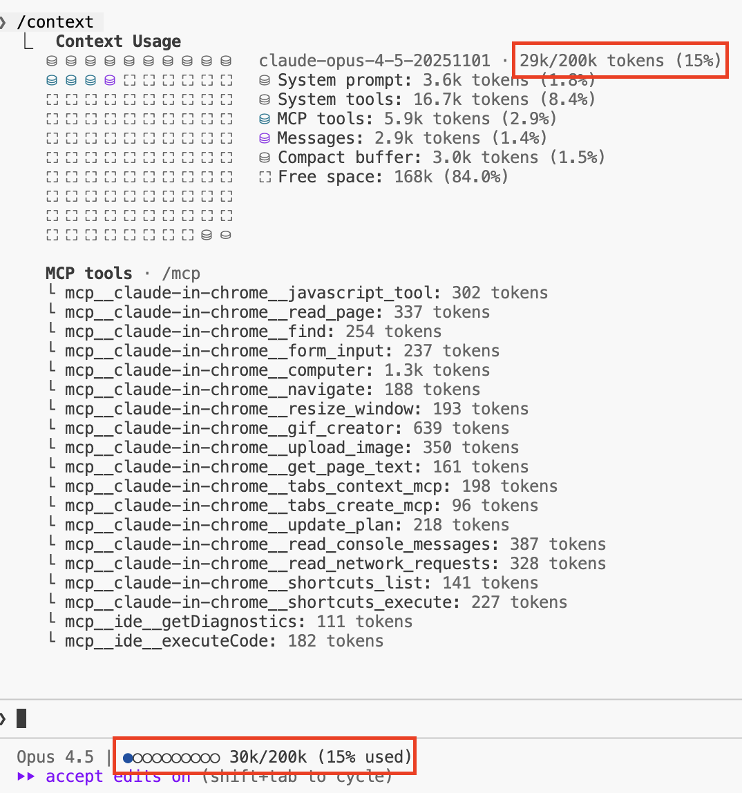

# Claude Code Status Line

A minimal status line script for [Claude Code](https://claude.ai/) that displays model name and context window usage.




## Preview

**Session start (loading state):**
```
Opus 4.5 | ○○○○○○○○○○ loading...
```

**Normal usage (blue circles):**
```
Opus 4.5 | ●●●○○○○○○○ 30k/200k (15% used)
```

**Warning state (red circles when > 60%):**
```
Opus 4.5 | ●●●●●●●○○○ 140k/200k (70% used)
```

## Features

- **Context Window Display**: Shows token usage with circle-based progress bar
- **Loading State**: Empty circles with "loading..." at session start
- **Warning Indicator**: Circles turn red when context usage exceeds 60%
- **Minimal Design**: Shows only model name and context - no clutter

## Requirements

- Claude Code v2.1.6 or higher
- `jq` (JSON processor)
- Bash shell

## Installation

1. **Create the scripts directory** (if it doesn't exist):
   ```bash
   mkdir -p ~/.claude/scripts
   ```

2. **Copy the script**:
   ```bash
   curl -o ~/.claude/scripts/status-line.sh https://raw.githubusercontent.com/shanraisshan/claude-code-status-line/main/status-line.sh
   ```

   Or manually copy `status-line.sh` to `~/.claude/scripts/`

3. **Make it executable**:
   ```bash
   chmod +x ~/.claude/scripts/status-line.sh
   ```

4. **Configure Claude Code** by adding to `~/.claude/settings.json`:
   ```json
   {
     "statusLine": {
       "type": "command",
       "command": "~/.claude/scripts/status-line.sh"
     }
   }
   ```

5. **Restart Claude Code** to see the new status line.

## How It Works

The script reads JSON data from Claude Code via stdin and displays:

- **Model name**: From `model.display_name` or `model.id`
- **Context usage**: Calculated from `context_window.used_percentage`
- **Progress bar**: 10 circles showing usage visually


## Status Line Input JSON

Claude Code pipes JSON data to your status line script. Key fields used:

```json
{
  "context_window": {
    "context_window_size": 200000,
    "used_percentage": 24
  },
  "model": {
    "id": "claude-opus-4-5-20251101",
    "display_name": "Opus 4.5"
  }
}
```

## Created By

Claude Code
