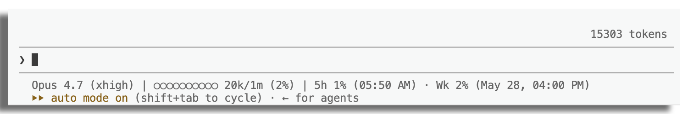
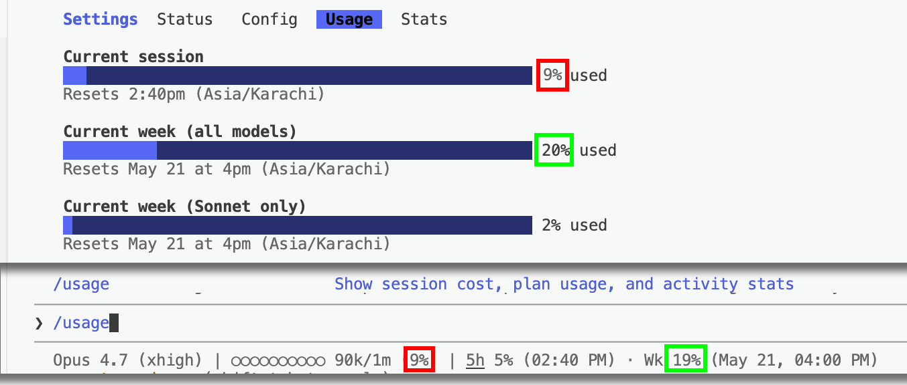

# Claude Code Status Line

<p align="center">
  
  
</p>

<p align="center">
  
</p>

```
Model (effort) | ○○○○○○○○○○ 20k/1m Context Window (2% used) | 5hour-Limit 1% used (ends on 05:50 AM) · Weekly-Limit 2% used (ends on May 28, 04:00 PM)
```

### Comparision with usage

<p align="center">
  
</p>

## Installation

1. **Create the scripts directory** (if it doesn't exist):
   ```bash
   mkdir -p ~/.claude/scripts
   ```

2. **Copy the script**:
   ```bash
   curl -o ~/.claude/scripts/status-line.sh https://raw.githubusercontent.com/shanraisshan/claude-code-status-line/main/status-line.sh
   ```

   Or manually copy `status-line.sh` to `~/.claude/scripts/`

3. **Make it executable**:
   ```bash
   chmod +x ~/.claude/scripts/status-line.sh
   ```

4. **Configure Claude Code** by adding to `~/.claude/settings.json`:
   ```json
   {
     "statusLine": {
       "type": "command",
       "command": "~/.claude/scripts/status-line.sh"
     }
   }
   ```

5. **Restart Claude Code** to see the new status line.

## Other Repos

<table>
<tr>
<td align="center" width="140">
  <a href="https://github.com/shanraisshan/claude-code-best-practice"></a><br>
  <a href="https://github.com/shanraisshan/claude-code-best-practice"><strong>Claude Code<br>Best Practice</strong></a>
</td>
<td align="center" width="140">
  <a href="https://github.com/shanraisshan/claude-code-hooks"></a><br>
  <a href="https://github.com/shanraisshan/claude-code-hooks"><strong>Claude Code<br>Hooks</strong></a>
</td>
<td align="center" width="140">
  <a href="https://github.com/shanraisshan/codex-cli-best-practice"></a><br>
  <a href="https://github.com/shanraisshan/codex-cli-best-practice"><strong>Codex CLI<br>Best Practice</strong></a>
</td>
<td align="center" width="140">
  <a href="https://github.com/shanraisshan/codex-cli-hooks"></a><br>
  <a href="https://github.com/shanraisshan/codex-cli-hooks"><strong>Codex CLI<br>Hooks</strong></a>
</td>
<td align="center" width="140">
  <a href="https://github.com/shanraisshan/gemini-cli-best-practice"></a><br>
  <a href="https://github.com/shanraisshan/gemini-cli-best-practice"><strong>Gemini CLI<br>Best Practice</strong></a>
</td>
<td align="center" width="140">
  <a href="https://github.com/shanraisshan/gemini-cli-hooks"></a><br>
  <a href="https://github.com/shanraisshan/gemini-cli-hooks"><strong>Gemini CLI<br>Hooks</strong></a>
</td>
</tr>
</table>
